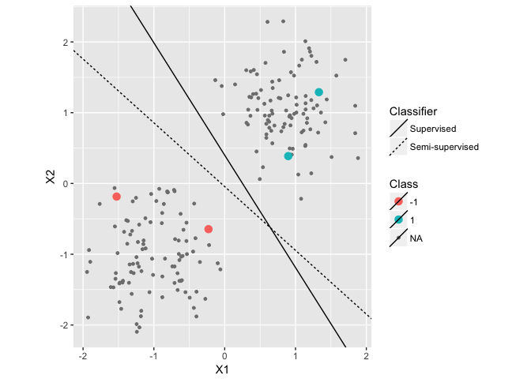

<!-- README.md is generated from README.Rmd. Please edit that file -->
[](https://travis-ci.org/jkrijthe/RSSL) [](https://codecov.io/github/jkrijthe/RSSL?branch=master)

R Semi-Supervised Learning package
==================================

This R package provides implementations of several semi-supervised learning methods, in particular, our own work involving constraint based semi-supervised learning.

The package is still under development. Therefore, function names and interfaces are subject to change.

To cite the package, use either of these two references:

-   Krijthe, J.H. & Loog, M. (2015). Implicitly Constrained Semi-Supervised Least Squares Classification. In E. Fromont, T. de Bie, & M. van Leeuwen, eds. 14th International Symposium on Advances in Intelligent Data Analysis XIV (Lecture Notes in Computer Science Volume 9385). Saint Etienne. France, pp. 158-169.
-   Jesse H. Krijthe (2016). RSSL: Implementations of Semi-Supervised Learning Approaches for Classification, URL: <https://github.com/jkrijthe/RSSL>

Installation Instructions
=========================

This package is not yet available on CRAN. To install the latest version of the package using the devtools package:

``` r
library(devtools)
install_github("jkrijthe/RSSL")
```

Usage
=====

After installation, load the package as usual:

``` r
library(RSSL)
```

The following code generates a simple dataset, trains a supervised and two semi-supervised classifiers and evaluates their performance:

``` r
library(dplyr,warn.conflicts = FALSE)
library(ggplot2,warn.conflicts = FALSE)

set.seed(2)
df <- generate2ClassGaussian(200, d=2, var = 0.2, expected=TRUE)

# Randomly remove labels
df <- df %>% add_missinglabels_mar(Class~.,prob=0.98) 

# Train classifier
g_nm <- NearestMeanClassifier(Class~.,df,prior=matrix(0.5,2))
g_self <- SelfLearning(Class~.,df,
                       method=NearestMeanClassifier,
                       prior=matrix(0.5,2))

# Plot dataset
df %>% 
  ggplot(aes(x=X1,y=X2,color=Class,size=Class)) +
  geom_point() +
  coord_equal() +
  scale_size_manual(values=c("-1"=3,"1"=3), na.value=1) +
  geom_linearclassifier("Supervised"=g_nm,
                  "Semi-supervised"=g_self)
```



``` r

# Evaluate performance: Squared Loss & Error Rate
mean(loss(g_nm,df))
mean(loss(g_self,df))


mean(predict(g_nm,df)!=df$Class)
mean(predict(g_self,df)!=df$Class)
```

Acknowledgement
===============

Work on this package was supported by Project 23 of the Dutch national program COMMIT.
